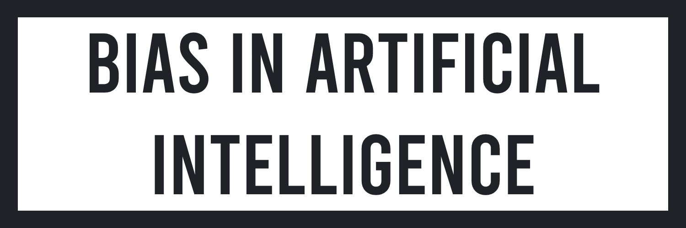
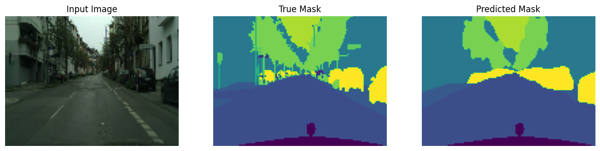
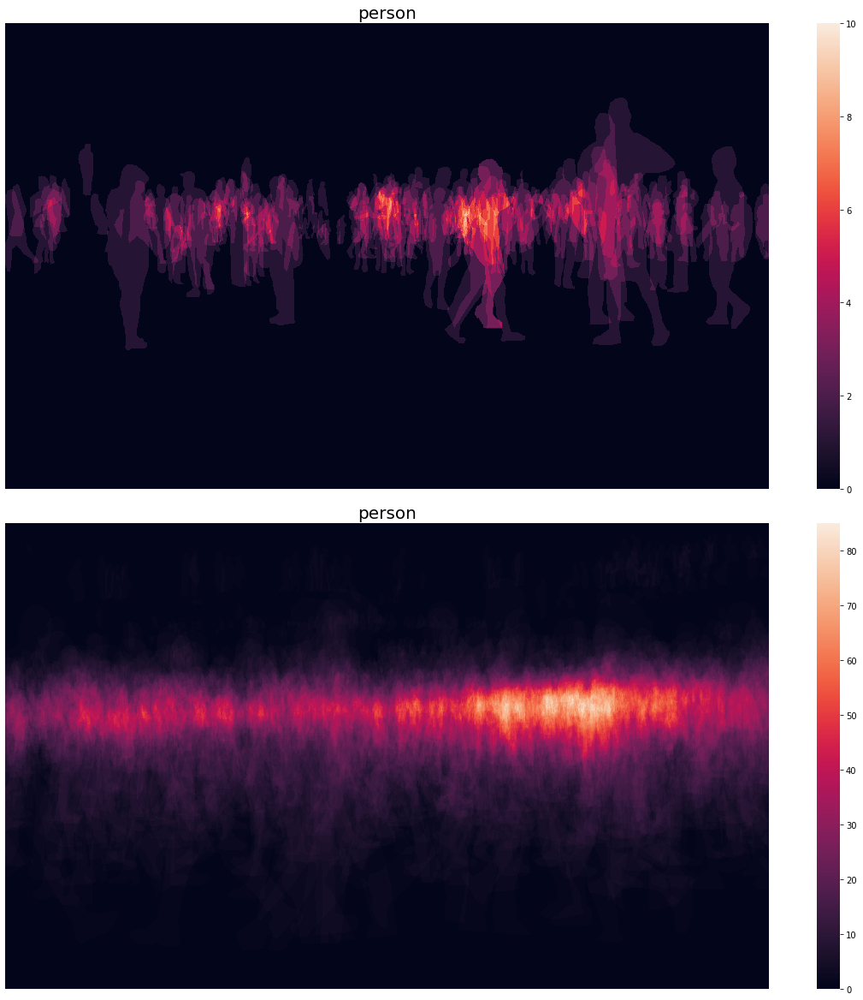
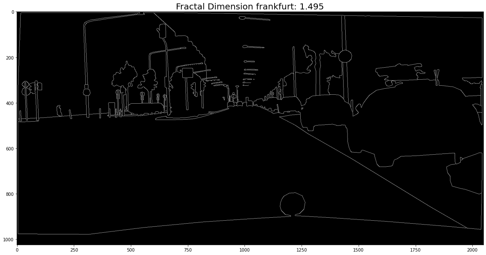

# About The Project
This project takes on a pivotal challenge in the AI field: addressing learning bias. We will primarily focus on the CITYSCAPES dataset for our research. This dataset has been processed using Python. Our main objective is to comprehend how bias may manifest within machine learning models and to explore techniques for its detection and mitigation. Our methodology will adhere to the conventional machine learning problem-solving framework, encompassing several essential stages: data collection and preprocessing, exploratory data analysis, model selection and training, evaluation of model performance, and lastly, model optimization. Throughout this comprehensive process, we will maintain a keen vigilance on those junctures where biases may infiltrate, originating either from the data itself or from the algorithms employed. This meticulous scrutiny is vital for ensuring the fairness and reliability of our machine learning models.

# Preview

Cityscapes is a large dataset of urban scene images from 50 different cities for use in computer vision research, particularly for semantic segmentation and scene recognition. Each image in the dataset is accompanied by a precise annotation that indicates the object category of each pixel (e.g. car, building, pedestrian). The model under investigation is a Convolutional Neural Network (CNN) architecture known as UNet, which is specifically designed for image segmentation tasks. UNet is characterized by its distinctive U-shaped architecture, featuring a contracting path for feature extraction and a symmetric expanding path for precise localization. This architecture has proven to be highly effective in tasks such as medical image segmentation, object detection, and semantic segmentation in computer vision applications. UNet's ability to capture fine-grained details and accurately delineate object boundaries in images makes it a popular choice for a wide range of image segmentation challenges.

# Results
## Area Bias

In our research, we have also identified what we term a "surface bias." This bias manifests as follows: if a particular class is significantly prevalent in a specific region of an image, there is a greater likelihood that this class will be predicted in that same region of the image. In essence, the model exhibits a propensity to associate the overrepresented class with the specific image region where it is most frequently observed. This surface bias highlights the model's sensitivity to the spatial distribution of classes within an image, emphasizing the importance of addressing this bias to ensure more balanced and accurate predictions across the entire image.

## Complexity Bias

We have also encountered a bias related to image complexity, which can be described as follows: the less complex an image is (measured using fractal dimension), the more likely the model is to prioritize classes that are highly represented in the dataset. This bias is indicative of the model's sensitivity to the level of visual intricacy present in an image. It implies that, when confronted with simpler or less visually complex images (as quantified by their fractal dimension), the model has a tendency to favor classes that have a strong presence in the dataset. In essence, the model is more inclined to make predictions that align with the dataset's class distribution when it encounters less complex visual content. Recognizing and mitigating this complexity-related bias is crucial for achieving more robust and equitable predictions across a wide spectrum of image complexities, ensuring that the model's performance is not disproportionately influenced by image simplicity or complexity.

## Density Bias
In our investigation, we have uncovered what we refer to as a "density bias." This bias manifests in the sense that the predictions made by our model tend to favor classes that are more heavily represented in the dataset. In other words, classes with a higher frequency of occurrence within the dataset are more likely to be predicted by the model. This phenomenon highlights the model's sensitivity to the distribution of classes in the data, and it underscores the need for mitigation strategies to ensure fair and accurate predictions across all classes, irrespective of their representation.

---

By Axel Hippolite.
